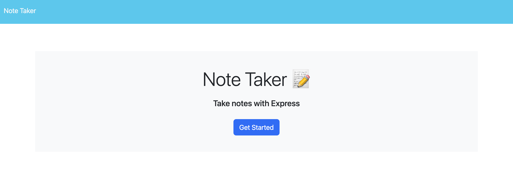
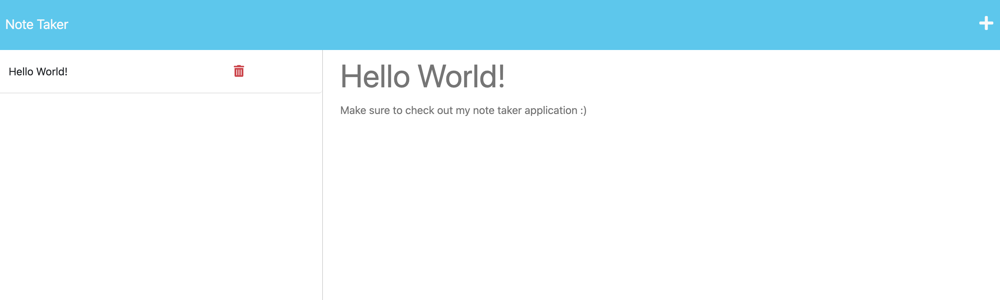

# Note Taker Application

## Description

This application allows users to add, store, and delete notes. Each note comes with a note title and note description so it is easily accessible to read at a further time. I contributed to the code by creating the backend and connecting it to the frontend. I was able to further use my express.js skills. The entire application has been deployed to Heroku.

## Deployed Website

The following is are screenshots and the url of the deployed website: 

- https://note-taker-app.herokuapp.com/

## Questions

If you have any further questions, please reach out to me using the following contact methods:
- Github: [albertosuarez8](https://github.com/albertosuarez8)
- Email: alberto.suarez8@outlook.com
